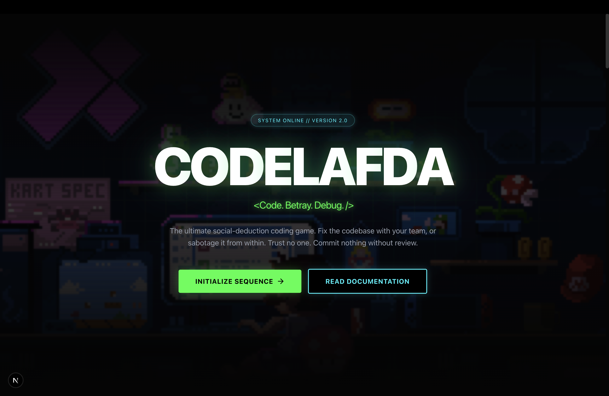

# CodeLafda

> **Code. Betray. Debug.**
> A real-time multiplayer social deduction coding game where developers collaborate to fix bugs while an impostor sabotages the codebase.



## Overview

**CodeLafda** combines the thrill of social deduction games (like Among Us) with the intellectual challenge of collaborative coding. Players are dropped into a "broken" codebase and assigned roles:
- **Hackers (Good)**: Must solve coding challenges, fix bugs, and optimize code to restore system integrity.
- **Impostor (Bad)**: Must secretly introduce subtle bugs, delete critical logic, or waste time without getting caught.

The game features real-time code synchronization, live compilation/execution, and a voting system to eject suspected impostors.

## Key Features

- **Real-Time Multiplayer**: Built with WebSockets (PartyKit) for instant code updates, cursor tracking, and chat.
- **Role-Based Gameplay**: Asymmetric goals for Hackers vs. Impostors.
- **Live Code Editor**: Monaco Editor integration with simulated "compilation" and test case validation.
- **Interactive Sabotages**: Impostors can trigger UI glitches, screen shakes, and keyboard input delays to hinder the team.
- **Lobby System**: Create private rooms, customize game settings (difficulty, round time), and manage players.
- **Progression**: XP system, leaderboards, and "Developer Ranks" from Script Kiddie to AI Overlord.

## Technology Stack

### Frontend
- **Framework**: [Next.js 15](https://nextjs.org/) (App Router)
- **UI Library**: React 19, Tailwind CSS v4, Lucide React
- **Animations**: GSAP, Framer Motion
- **Editor**: Monaco Editor (`@monaco-editor/react`)

### Backend & Real-time
- **Infrastructure**: [PartyKit](https://partykit.io/) (Cloudflare Workers)
- **State Management**: Server-authoritative state with optimistic updates
- **Validation**: Zod schema validation for all events

### Deployment
- **Frontend**: Vercel / Netlify
- **WebSocket Server**: PartyKit Cloud

## Installation & Setup

### Prerequisites
- Node.js 18+
- npm / pnpm / yarn

### Local Development

1. **Clone the repository**
   ```bash
   git clone https://github.com/yourusername/codelafda.git
   cd codelafda
   ```

2. **Install dependencies**
   ```bash
   npm install
   ```

3. **Start the development servers**
   Runs both the Next.js frontend (port 3000) and PartyKit server (port 1999).
   ```bash
   npm run dev:all
   ```

4. **Access the game**
   Open http://localhost:3000 to launch the lobby.

### Environment Variables
Create a `.env.local` file if you have specific environment requirements (not strictly required for local dev as defaults are provided).

```env
NEXT_PUBLIC_PARTYKIT_HOST=localhost:1999
```

### Production Build

1. **Build the Next.js application**
   ```bash
   npm run build
   ```

2. **Deploy PartyKit Server**
   ```bash
   npx partykit deploy
   ```

## Usage Guide

### Starting a Game
1. Enter a username and click "Initialize Sequence" on the home page.
2. Creates a new Lobby. Share the **Room ID** with friends.
3. The host configures settings (Impostor count, Difficulty) and clicks **Start Game**.

### Playing as a Hacker (Crewmate)
- **Objective**: Complete all assigned coding tasks (Tasks bar filled) or identify and vote out the Impostor.
- **Tasks**: Navigate to files with errors (red icon), fix the code, and run tests.
- **Communication**: Use the in-game chat to discuss suspicious behavior.

### Playing as an Impostor
- **Objective**: Stop Hackers from completing tasks by running down the clock or depleting the "System Integrity".
- **Sabotage**: Use the Sabotage Panel to deploy annoyances (e.g., "Syntax Error Flood", "CSS Glitch").
- **Deception**: Pretend to fix code. You can modify code to technically "pass" but break logic elsewhere if you are skilled!

## Contribution Guidelines

We welcome contributions! Please follow these steps:

1. **Fork the repository**.
2. **Create a feature branch**: `git checkout -b feature/amazing-feature`.
3. **Commit your changes**: `git commit -m 'Add amazing feature'`.
4. **Push to the branch**: `git push origin feature/amazing-feature`.
5. **Open a Pull Request**.

### Code Quality
- Ensure no linting errors: `npm run lint`.
- Use TypeScript for all new files.
- Keep components small and focused.

## License

Distributed under the MIT License. See `LICENSE` for more information.

Copyright (c) 2026 CodeLafda
